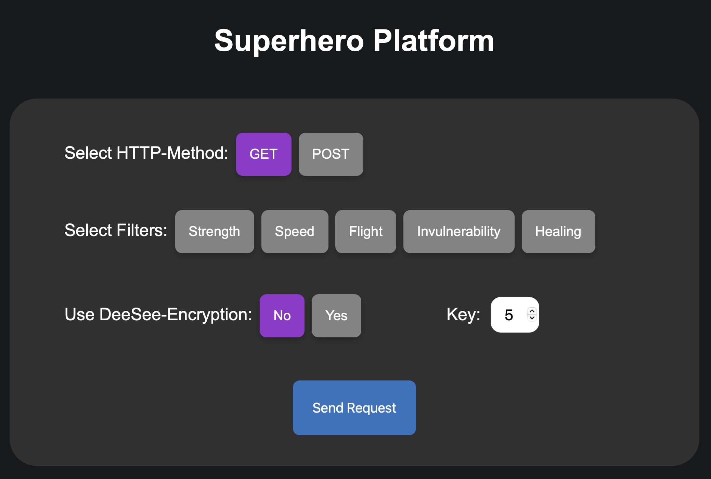

# Superhero REST API Documentation

This API enables functionality to interact with superhero data. You can retrieve and create superhero records, filter them based on superpowers and encrypt them based on a specific key.

---

## PHP and PHPUnit Setup Guide

Firstly install PHP. To check if PHP is installed on your system, run:

```bash
php -v
```

### Tests

---

To run the tests firstly install PHPUnit by the following command from the root directory:

```bash
composer require --dev phpunit/phpunit ^11
```

After that, you can start the tests by running:

```bash
php vendor/bin/phpunit tests
```

### Local Server

---

In the root directory of the project, start the local PHP server by running:

```bash
php -S localhost:8000
```

## API Interface

The API supports GET and POST requests. To send requests to the backend consider the Base-URL: `http://localhost:8000/backend/src/rest-api.php`

---

### GET - Parameters

At least the `all` or a filter parameter must be specified.

| **Parameter** | **Required** | **Type**   | **Default Value** | **Description**                                                                 |
|---------------|--------------|------------|-------------------|---------------------------------------------------------------------------------|
| `all`         | No           | `boolean`  | `false`           | If set to `1`, retrieves all superheroes. Ignores other filter parameters.      |
| `str`         | No           | `boolean`  | `false`           | Filters superheroes with the `strength` superpower.                            |
| `spd`         | No           | `boolean`  | `false`           | Filters superheroes with the `speed` superpower.                               |
| `fly`         | No           | `boolean`  | `false`           | Filters superheroes with the `flying` superpower.                              |
| `invul`       | No           | `boolean`  | `false`           | Filters superheroes with the `invulnerability` superpower.                     |
| `heal`        | No           | `boolean`  | `false`           | Filters superheroes with the `healing` superpower.                             |
| `enc`         | No           | `boolean`  | `false`           | If set to `1`, encrypts superhero names in the response using the specified key.|
| `key`         | No           | `integer`  | `5`               | Encryption key (range: 1–28). Used only if `enc=1`.                            |


### POST - Parameters (JSON Body)

| **Parameter**       | **Required** | **Type**      | **Description**                                                              |
|---------------------|--------------|---------------|------------------------------------------------------------------------------|
| `name`             | Yes          | `string`      | Superhero's name in lowercase.                                               |
| `identity`         | Yes          | `object`      | Contains `firstName` and `lastName`.                |
| `birthday`         | Yes          | `string`      | Superhero's birthday in `YYYY-MM-DD` format.                                 |
| `superpowers`      | Yes          | `array`       | List of superhero's powers (valid values: `strength`, `speed`, `flying`, etc.).|

## Example Usage

In the following are some example requests. 

### Get-Method

Retrieve all superheroes:
```bash
curl -X GET "http://localhost:8000/backend/src/rest-api.php?all=1"
```

Retrieve the encrypted identity of superheroes that have the speed and healing superpower:
```bash
curl -X GET "http://localhost:8000/backend/src/rest-api.php?spd=1&heal=1&enc=1"
```

### Post-Method

Specify all parameters in a case-sensitive manner for the JSON object, following the format below:

```bash
curl -X POST "http://localhost:8000/backend/src/rest-api.php" \
-H "Content-Type: application/json" \
-d '{
    "name": "aquaman",
    "identity": {"firstName": "arthur", "lastName": "curry"},
    "birthday": "1986-01-29",
    "superpowers": ["strength"]
}'
```

---

## Web Interface

The project also includes a web interface to easily communicate with the **Superhero REST API**. This enables users to send requests to the server and receive dynamic responses directly through the web interface.

If the server is running, you can access the [Web Interface](http://localhost:8000/frontend/index.html).

### How It Works
1. **Frontend Setup:** The frontend sends HTTP requests (e.g., `GET` or `POST`) to the API endpoint using JavaScript and AJAX.
2. **Response Handling:** The server processes the request and responds with data or error messages.
3. **Dynamic Updates:** The frontend parses the response and updates the user interface accordingly.


